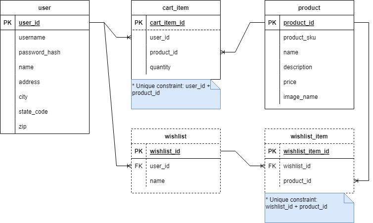

# Shopping Cart API

This project is a REST API that supports an online shopping cartItem.

## Database setup

Included is a test database which will need to be created prior to running the application. 

> Note: The script creates two users for use in testing, `user` and `admin`, which both have the password: `password`.

## Features

### Login Information:

1. As a user of the system, I need to be able to register myself with a username, address information, and password.
1. As a user of the system, I need to be able to log in using my registered username and password.

API endpoints:
1. POST `/register` (Provided Use Case 1)
1. POST `/login` (Provided Use Case 2)

### Cart Functionality:

Use cases:
1. As an unauthenticated user, I can see a list of products for sale.
1. As an unauthenticated user, I can search for a list of products by name or SKU.
1. As an unauthenticated user, I can view additional information about a specific product (product detail).
1. As a user, I can view my shopping cartItem and see the following details:
    * The list of products, quantities, and prices in my cartItem
    * The subtotal of all products in my cartItem
    * The tax amount (in U.S. dollars) charged for my state
        - Obtain the tax rate from an external API using the URL: https://teapi.netlify.app/api/statetax?state=[state-code].
        - The state code is part of the user address information.
        - The tax rate returned from the API is a percentage. Convert this to a decimal value to use in calculating the tax amount.
    * The cartItem total, which is the subtotal plus the amount of tax
1. As a user, I can add a product to my shopping cartItem.
    * If the product is already in my cartItem, increase the quantity appropriately.
    * The quantity added must be positive.
1. As a user, I can remove a product from my shopping cartItem. This removes the item from the cartItem entirely, regardless of the quantity in the cartItem.
1. As a user I can clear my cartItem, removing all the items from the cartItem.

API endpoints:
1. GET `/products` - get the list of products (Use Case 1)
1. GET `/products?sku={product_sku}&name={product_name}` - search for products (Use Case 2)
1. GET `/products/{id}` - get a single product (Use Case 3)
1. GET `/cartItem` - get the user's cartItem (Use Case 4)
1. POST `/cartItem/items` - add item to cartItem (Use Case 5)
1. DELETE `/cartItem/items/{itemId}` - remove item from cartItem (Use Case 6)
1. DELETE `/cartItem` - clear cartItem (Use Case 7)

### Wishlists:

Use cases:
1. As a user, I can see a list of all of my wishlists.
1. As a user, I can see a single wishlist, including a list of the items on the wishlist.
1. As a user, I can create and name a new wishlist.
1. As a user, I can delete an existing wishlist that I own.
1. As a user, I can add a product to a wishlist that I own. If the item is already in the wishlist, it's not added a second time, but no error is raised.
1. As a user, I can remove a product from a wishlist that I own. If the item isn't in the wishlist, it's not deleted, but no error is raised.

API endpoints:
1. GET `/wishlists` - get user wishlists (Use Case 1)
1. GET `/wishlists/{wishlistId}` - get wishlist (Use Case 2)
1. POST `/wishlists` - create wishlist (Use Case 3)
1. DELETE `/wishlists/{wishlistId}` - delete wishlist (Use Case 4)
1. POST `/wishlists/{wishlistId}/products/{productId}` - add product to wishlist (Use Case 5)
1. DELETE `/wishlists/{wishlistId}/products/{productId}` - remove product from wishlist (Use Case 6)
